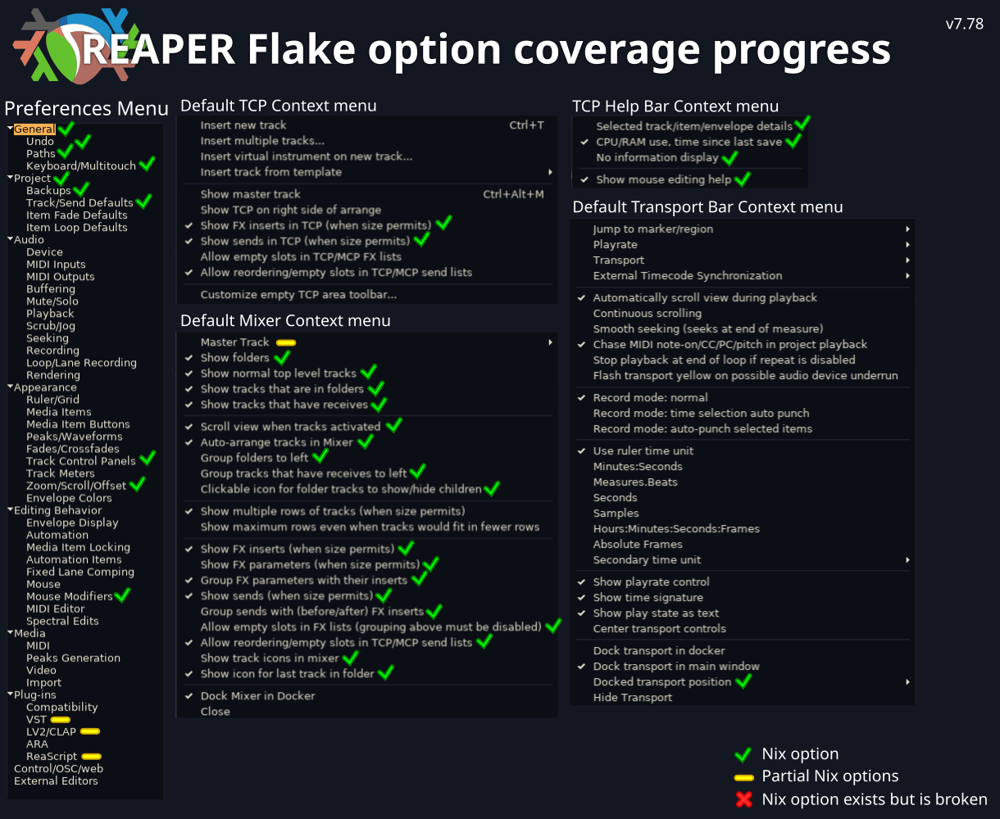

<p align="center">
  
</p>

<h1 align="center">reaper-flake</h1>

<p align="center">
  Nix flake for REAPER packages and Home Manager configuration.
</p>

<p align="center">
  <a href="https://www.reaper.fm/"></a>
  <a href="https://reapack.com/"></a>
  <a href="https://www.sws-extension.org/"></a>
</p>

## Packages

| Package       | Version    | Output                            |
| ------------- | ---------- | --------------------------------- |
| REAPER        | `7.78`     | `packages.reaper`                 |
| ReaPack       | `1.2.6`    | `packages.reapack`                |
| SWS           | `2.14.0.7` | `packages.sws`                    |
| SWELL Wayland | `1.1.0w`   | `packages.swell-wayland` on Linux |

Most package derivations are originally from nixpkgs with updated hashes and small tweaks. I will do my best to keep reaper as up to date as possible.

The SWELL wayland derivation was inspired by this [post](https://forum.cockos.com/showthread.php?t=305832).

### Themes

| Theme            | Version | Output                      |
| ---------------- | ------- | --------------------------- |
| Reapertips Theme | `1.90`  | `packages.reapertips-theme` |
| Smooth 6 Theme   | `2.1`   | `packages.smooth6-theme`    |

More packaged themes to come.

## Home Manager

Declare REAPER, seed its resource path, and link extensions from Nix-built packages.

> [!NOTE]
> If you are using something like impermanence or preservation you will want to persist the specified configPath manually. This is because REAPER has a stateful configuration model.

### Example

See [docs/layout.md](docs/layout.md) for a short explanation of layout, dock, and panel options, and [docs/menus.md](docs/menus.md) for declarative menus and toolbars.

```nix
{
  config,
  inputs,
  pkgs,
  reaperActions,
  reaperAppearance,
  reaperLayout,
  reaperMouse,
  reaperGeneral,
  reaperWindows,
  ...
}: {
  imports = [inputs.reaper-flake.homeModules.reaper];

  programs.reaper = {
    enable = true;
    configPath = "${config.xdg.configHome}/HOME-REAPER";

    extensions = {
      reapack.enable = true;
      sws.enable = true;
    };

    swell.colortheme = {
      enable = true;

      # Use "stylix" here when Stylix is imported.
      preset = "reapertips";

      settings = {
        default_font_face = "Liberation Sans";
        default_font_size = 13;
        menubar_height = 17;
        scrollbar_width = 14;
        focus_hilight = "#d1a660";
      };
    };

    theme = {
      # Select a file available in ColorThemes.
      active = "Smooth_6.ReaperThemeZip";

      # Individual archives can come from a local path or a fetched derivation.
      colorThemes = [ ./themes/MyTheme.ReaperThemeZip ];

      # Packages expose REAPER assets in share/reaper and optional fonts in
      # share/fonts. Smooth 6 also supplies its theme-adjuster scripts.
      packages = [ inputs.reaper-flake.packages.${pkgs.system}.smooth6-theme ];

      # Keep programs.reaper.swell.colortheme authoritative (the default).
      includeSwellColorThemes = false;
    };

    layout = {
      docks = {
        bottom = {
          id = 3;
          position = "bottom";
          size = 320;
          selectedPanel = "mixer";
        };

        left = {
          id = 2;
          position = "left";
          size = 395;
          selectedPanel = "explorer";
        };
      };

      mainWindow = {
        position = {
          x = 0;
          y = 0;
        };
        size = {
          width = 1600;
          height = 900;
        };
        state = reaperLayout.windowState.normal;
      };

      mixer = {
        visible = true;
        docked = true;
        dock = "bottom";
        tabOrder = 0.0;
        size.height = 320;
      };

      transport = {
        visible = true;
        docked = true;
        dock = "bottom";
        tabOrder = 1.0;
        dockPosition = reaperWindows.transport.topOfMainWindow;
      };

      panels.explorer = {
        id = "explorer";
        section = "reaper_sexplorer";
        keyStyle = "window";
        visible = true;
        docked = true;
        dock = "left";
        tabOrder = 0.5;
      };
    };

    preferences = {
      general.startupSettings = {
        openProjectOnStartup = reaperGeneral.openProjectOnStartup.newProjectIgnoreDefaultTemplate;
        showSplashScreenOnStartup = false;
      };

      project.backups = {
        whenSaving.preservePreviouslySavedVersionOfProjectAsRppBak = {
          enable = true;
          saveTimestampedBackupsToProjectBackupsSubdirectory = true;
        };

        autoSave = {
          autoSaveToTimestampedFileInProjectDirectory = {
            enable = true;
            saveBackupsToProjectAutoSavesSubdirectory = true;
          };
          autoSaveToProjectFile = false;
          autoSaveUnsavedProjectsToTemporaryFile = true;
          autoSaveInterval = {
            minutes = 10;
            mode = "whenNotRecording";
          };
        };
      };

      appearance = {
        trackControlPanels = {
          setTrackLabelBackgroundToCustomTrackColors = true;
          tintTrackPanelBackgrounds = false;
          alignTcpControlsWhenTrackIconsOrFixedItemLanesAreUsed = true;

          showFxInserts = true;
          showSends = true;
          groupSendsWithFxInserts = false;
          groupFxParametersWithInserts = true;
        };

        zoomScrollOffset = {
          horizontalZoomCenter = reaperAppearance.zoomScrollOffset.zoomCenter.horizontal.mouseCursor;
          limitHorizontalZoomScrollToProjectStart = false;
        };
      };

      editingBehavior = {
        mouseModifiers = {
          importedContexts = with reaperMouse; [
            contexts.arrange.middleDrag
            contexts.midiPianoRoll.leftClick
          ];

          contexts = with reaperMouse; merge [
            # Arrange view middle-drag: hand scroll/pan.
            (set contexts.arrange.middleDrag modifiers.none (mouse 7))

            # MIDI piano roll single-click: insert a note.
            (set contexts.midiPianoRoll.leftClick modifiers.none (mouse 4))
          ];
        };
      };

      plugIns = {
        reascript.python.enable = true;
        vst.searchPaths = ["~/Documents/VSTs"];
        clap.searchPaths = ["~/Documents/CLAP"];
      };

    };

    windows = {
      tcpHelpBar = {
        informationDisplay = reaperWindows.tcpHelpBar.informationDisplay.selectedTrackItemEnvelopeDetails;
        showMouseEditingHelp = true;
      };

      mixer = {
        autoArrangeTracks = true;
        showFxInserts = true;
        showSends = true;
        allowEmptySlotsInFxLists = true;

        master = {
          showInMixer = true;
          showOnRightSide = false;
        };
      };
    };

    actions = {
      scripts = [
        {
          path = "User/toggle-click.lua";
          source = ./scripts/toggle-click.lua;
          commandId = "RS_toggle_click";
          description = "Custom: toggle click";
        }
      ];

      keyBindings = with reaperActions; bindings [
        (shortcut {
          shortcut = "Space";
          command = commands.transport.play;
          actionName = "Transport: Play";
        })

        (shortcut {
          shortcut = "Ctrl+Alt+C";
          command = "RS_toggle_click";
          actionName = "Custom: toggle click";
        })

        (globalShortcut {
          shortcut = "Ctrl+Alt+Space";
          command = commands.transport.stop;
          scope = "global";
          actionName = "Transport: Stop";
        })
      ];
    };
  };
}
```

The preferences option set is designed to be as faithful to the gui option windows and tabs as possible.

A more exhaustive example, showing off more options can be found [here](./docs/EXAMPLE.md). You can also look at my personal reaper configuration [here](https://github.com/9Prestidigitator/.nixos/blob/17be8333423767756b780c526f9f71244be368e3/modules/home/desktop/applications/reaper/reaper.nix).

> [!WARNING]
> Home Manager activation refuses to modify the REAPER configuration while
> REAPER is running. Close REAPER and retry. Set
> `programs.reaper.activation.allowRunning = true` only when you accept that
> REAPER can overwrite activated values with its in-memory configuration on exit.

The default configuration path is `~/.config/reaper-flake` instead of `~/.config/REAPER` to avoid overwriting original configurations, this can be changed with `programs.reaper.configPath`.

When removing an option from your configuration that was instantiated with the flake, the the module will automatically clean up the option in the ini. Reseting it to whatever the default reaper value. That is the purpose of the `.nix-managed` directory in the config directory. For bitfields it will just clean the managed bit mask.

> [!NOTE]
> If you are using the raw default package exposed by the flake you have to specify the configuration path when launching REAPER: `reaper -cfgfile ~/.config/reaper-flake/reaper.ini`.

## Roadmap

Continue studying Reaper configuration model to support options I use most to be set. Found this [site](https://mespotin.uber.space/Ultraschall/Reaper_Config_Variables.html) as a good starting point.

<p align="center">
  
</p>

## Known Issues

- Individual ReaPack package changes are queued during Home Manager activation
  and applied on the next REAPER start. They require the patched ReaPack package
  supplied by this flake; overriding the ReaPack package with an unmodified
  upstream binary disables this feature.
- Control-surface MIDI inputs and outputs are stored by REAPER as
  machine-local, zero-based device indexes. A declaration may need different
  indexes on hosts whose MIDI device ordering differs.

## Inspirations

- [plasma-manager](https://github.com/nix-community/plasma-manager)
- [audio.nix](https://github.com/polygon/audio.nix)
