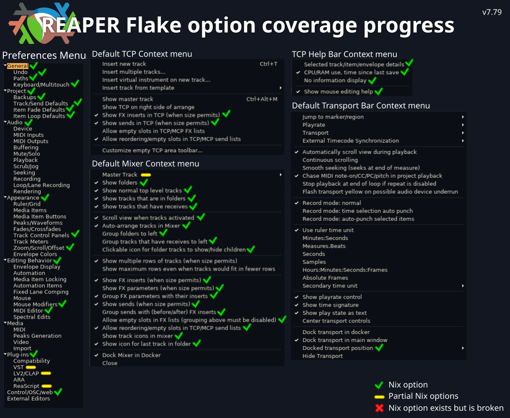

# reaper-flake

Declarative REAPER packages and Home Manager configuration with Nix.

[](https://www.reaper.fm/)
[](https://reapack.com/)
[](https://www.sws-extension.org/)

<p align="center">
  
</p>

reaper-flake provides a Home Manager module for configuring REAPER on NixOS, other Linux systems, and macOS. It also packages REAPER, ReaPack, SWS, themes, and the experimental [Wayland SWELL library](https://forum.cockos.com/showthread.php?p=2953586).

The module updates only the values declared in Nix. REAPER remains free to manage its other settings and runtime state, so you can continue using the GUI for options that are not yet exposed.

## Quick start

Add the flake to your inputs:

```nix
{
  inputs.reaper-flake.url = "github:9Prestidigitator/reaper-flake";
}
```

Import the Home Manager module and enable REAPER in the Home Manager configuration for your user. For example, a minimal standalone Home Manager flake could look like this:

```nix
{
  description = "Home Manager configuration with REAPER";

  inputs = {
    nixpkgs.url = "github:NixOS/nixpkgs/nixos-unstable";
    home-manager = {
      url = "github:nix-community/home-manager";
      inputs.nixpkgs.follows = "nixpkgs";
    };
    reaper-flake.url = "github:9Prestidigitator/reaper-flake";
  };

  outputs = inputs @ { nixpkgs, home-manager, ... }:
    let
      system = "x86_64-linux";
      pkgs = import nixpkgs {
        inherit system;
        config.allowUnfree = true;
      };
    in {
      homeConfigurations.your-user = home-manager.lib.homeManagerConfiguration {
        inherit pkgs;

        extraSpecialArgs = { inherit inputs; };

        modules = [
          inputs.reaper-flake.homeModules.reaper
          ({ ... }: {
            home = {
              username = "your-user";
              homeDirectory = "/home/your-user";
              stateVersion = "25.05";
            };

            programs.reaper = {
              enable = true;

              extensions = {
                reapack.enable = true;
                sws.enable = true;
              };

              preferences = {
                general.startupSettings.showSplashScreenOnStartup = false;
                project.trackSendDefaults.trackVolumeFaderGain = -10.0;
                plugIns.reascript.python.enable = true;
              };
            };
          })
        ];
      };
    };
}
```

Replace `your-user`, the home directory, and `system` with your values, then apply it with `home-manager switch --flake .#your-user`. On NixOS, import the module in your existing Home Manager configuration instead of creating a standalone `homeConfigurations` output. REAPER must be closed while Home Manager activates changes; this protects the generated values from being overwritten by REAPER’s in-memory state.

For a larger, copyable configuration covering themes, layouts, menus, actions, preferences, and ReaPack, see [docs/EXAMPLE.md](docs/EXAMPLE.md).

## What it supports

- REAPER preferences, including INI values and shared bitfields.
- Keyboard shortcuts, action sections, custom actions, and scripts.
- Menus, context menus, main and MIDI toolbars, floating toolbars, submenus, labels, and toolbar flags.
- Windows, docks, panels, transport placement, and layout state.
- ReaPack repositories, synchronization settings, and individual packages.
- REAPER themes and theme packages, including `.ReaperTheme`/`.ReaperThemeZip` assets, scripts, and fonts. Direct `theme.colorThemes` links currently accept `.ReaperThemeZip` files; packages can provide either format.
- VST, VST3, CLAP, and LV2 search paths, including Nix-installed plugins.
- SWELL color themes and the experimental native-Wayland build.

The option names generally follow the labels in REAPER’s Preferences window. Enumerations and shared constants are provided by the module’s library arguments, for example `reaperActions`, `reaperMenus`, `reaperAppearance`, and `reaperWindows`.

## ReaPack example

Repositories and packages are declared independently. A package is identified by the repository name, category, and package name from the repository index:

```nix
programs.reaper.extensions.reapack = {
  enable = true;

  repositories = [
    {
      name = "reaper-keys";
      url = "https://raw.githubusercontent.com/gwatcha/reaper-keys/master/index.xml";
    }
  ];

  packages = [
    {
      repository = "reaper-keys";
      category = "Scripts";
      name = "install-reaper-keys.lua";
    }
  ];

  synchronizeOnActivation = true;
};
```

The package declaration is applied through ReaPack’s native transaction engine when REAPER starts. `version` is optional; `pin = true` prevents synchronization from moving a package away from the declared version. See [docs/reapack.md](docs/reapack.md) for package identity, repository settings, pins, and troubleshooting.

## Themes and assets

Theme packages can install more than a color theme: they may also provide scripts, fonts, and other resource files. The lower-level `colorThemes` option accepts individual theme files from any Nix path-producing expression, while `packages` accepts standardized theme derivations.

```nix
{ inputs, pkgs, ... }:
{
  programs.reaper = {
    theme = {
      active = "Reapertips Theme.ReaperThemeZip";
      packages = [
        inputs.reaper-flake.packages.${pkgs.system}.reapertips-theme
        inputs.reaper-flake.packages.${pkgs.system}.smooth6-theme
      ];
    };

    swell.colortheme = {
      enable = true;
      preset = "reapertips";
    };
  };
}
```

`swell.colortheme.preset` remains authoritative when explicitly configured; theme packages do not silently replace it.

## Packages

| Package             | Version  | Description                                       |
| ------------------- | -------- | ------------------------------------------------- |
| `reaper`            | 7.78     | REAPER, with optional Python ReaScript support    |
| `reapack` (patched) | 1.2.6    | ReaPack with the managed-package API              |
| `sws`               | 2.14.0.7 | SWS/S&M Extension                                 |
| `swell-wayland`     | 0.1      | Experimental native-Wayland SWELL build for Linux |

The flake’s package outputs target `x86_64-linux`, `aarch64-linux`, `x86_64-darwin`, and `aarch64-darwin` where the upstream package supports them. REAPER is proprietary software; enable unfree packages in the Nixpkgs configuration used to build it.

The SWELL Wayland package is experimental. It includes the X11 bridge needed for X11-based plugin windows, but plugin GUI compatibility depends on the plugin, Wine/bridge stack, graphics driver, and compositor.

| Themes             | Version |
| ------------------ | ------- |
| `reapertips-theme` | 1.90    |
| `smooth6-theme`    | 2.1     |

## Configuration model

By default, REAPER uses the isolated resource directory `~/.config/reaper-flake` instead of modifying an existing `~/.config/REAPER` installation. Change it with `programs.reaper.configPath` when desired.

Activation merges declared values into REAPER’s mutable files. Previous Nix-managed values are recorded under `<configPath>/.nix-managed/`, allowing the module to clean up values removed from the Nix configuration without replacing unrelated user settings. This state directory should be persisted when using impermanence or another ephemeral-home setup.

Activation fails if REAPER is running. `programs.reaper.activation.allowRunning = true` bypasses that guard, but is unsafe: closing REAPER afterward can write its old in-memory configuration over values just activated by Home Manager.

## Further Documentation

- [Large configuration example](docs/EXAMPLE.md)
- [Preferences and INI internals](docs/internal.md)
- [Actions and shortcuts](docs/actions.md)
- [Menus and toolbars](docs/menus.md)
- [Layouts and docks](docs/layout.md)
- [Generated preference options](docs/preferences.md)
- [ReaPack](docs/reapack.md)

<p align="center">
  
</p>

## Known issues

- The individual ReaPack package feature requires the patched ReaPack package supplied by this flake. Replacing it with an unmodified upstream binary removes the managed-package API.
- ReaPack package changes are queued during activation and take effect when REAPER next starts.
- MIDI control-surface device indexes are native zero-based indexes; they are not stable across all hardware or desktop-session changes.
- Native Wayland support is experimental and may show blank or incompatible third-party plugin windows. X11 REAPER remains the recommended configuration for production use.
- REAPER must be closed during activation unless the safety guard is explicitly overridden.

## Why this exists

REAPER stores much of its configuration in readable INI and line-oriented files, but those files also contain mutable application state. A complete-file symlink would make normal REAPER use awkward and could overwrite state unexpectedly. reaper-flake therefore generates a narrowly scoped payload and applies only the declared values during Home Manager activation.

# Inspirations

- [plasma-manager](https://github.com/nix-community/plasma-manager)
- [audio.nix](https://github.com/polygon/audio.nix)
